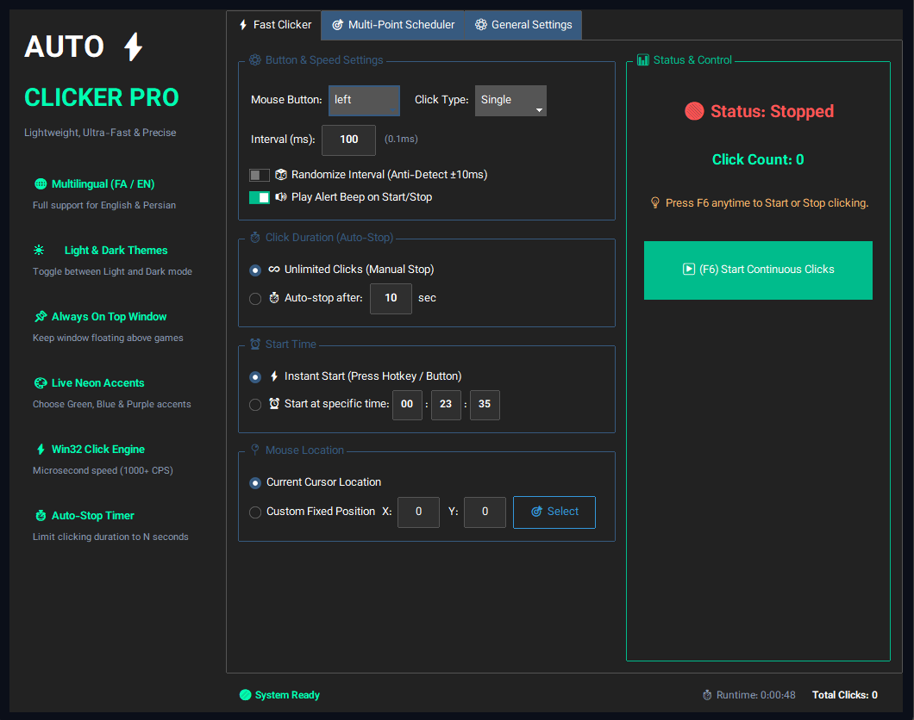
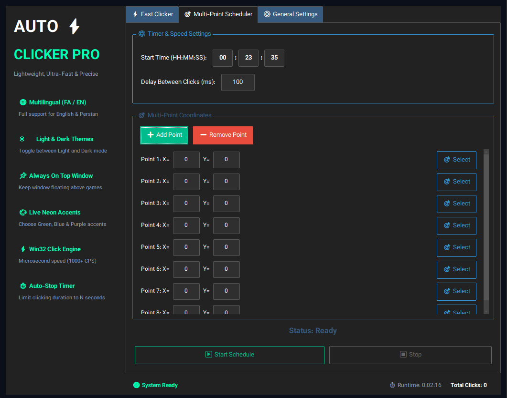

# ⚡ Auto Clicker Pro

  

  <b>Modern, Ultra-Fast & Multilingual Windows Auto Clicker</b> 
  نرم‌افزار حرفه‌ای، فوق‌العاده سریع و دو زبانه اتوماسیون کلیک ویندوز

---

## 🇬🇧 English Documentation

### 🌟 Key Features
- ⚡ **Win32 SendInput Speed Engine:** Microsecond-precision clicking engine achieving **1000+ CPS** (Clicks Per Second).
- 🌐 **Multilingual Support:** Live runtime language switching between **English** and **Persian (فارسی)**.
- ☀️ **Light & Dark Theme Modes:** Seamless toggle between **Dark Mode** and **Light Mode**.
- 🎨 **Live Neon Accent Colors:** Switch accent highlights between **Neon Green**, **Cyberpunk Blue**, and **Gaming Purple**.
- 📌 **Always On Top:** Floating window toggle to keep the application above full-screen games and windows.
- ⏱️ **Auto-Stop Duration Limit:** Option to automatically stop clicking after N seconds (e.g., 10 seconds).
- ⏰ **Scheduled Start Time:** Set an exact time (HH:MM:SS) to start continuous clicking automatically.
- ⌨️ **Custom Global Hotkey Selector:** Select any key (F1-F12, Insert, Delete, Home, End) to start/stop clicking from anywhere in Windows.
- 🎲 **Anti-Detection (Random Jitter):** Randomizes click interval by ±10ms to emulate human click behavior.
- 🔊 **Audio Feedback:** Play subtle ascending/descending alert beeps on start/stop.
- 📌 **System Tray Integration:** Minimizes cleanly to the Windows notification tray next to the clock.
- 🔤 **Native Vazirmatn Typography:** Sleek modern typography rendered across all UI components.

### 🚀 Getting Started

#### Run with Python:
pip install ttkbootstrap pyautogui Pillow pystray
python clicker.py

##### Build Windows .msi Installer:
pip install cx_Freeze
python setup.py bdist_msi

## 🇮🇷 راهنمای فارسی (Persian Documentation)

- ✨ امکانات و ویژگی‌های اصلی
- ⚡ موتور کلیک لایه پایین Win32 (SendInput): سرعت مایکروثانیه‌ای تا ۱۰۰۰+ کلیک در ثانیه.
- 🌐 سیستم دو زبانه آنی: پشتیبانی زنده از انگلیسی و فارسی.
- ☀️ سوییچ تم روشن و تاریک: امکان انتخاب بین Dark Mode و Light Mode.
- 🎨 تغییر تم زنده: امکان انتخاب بین رنگ‌های سبز نئونی، آبی سایبرپانک و بنفش گیمینگ.
- 📌 پنجره شناور (Always On Top): امکان نگه‌داشتن پنجره روی بقیه بازی‌ها و برنامه‌ها.
- ⏱️ توقف خودکار زمان‌بندی‌شده: قابلیت تعیین مدت زمان کلیک (مثلاً توقف بعد از ۱۰ ثانیه).
- ⏰ زمان‌بندی شروع کلیک: شروع کلیک پیوسته رأس ساعت مشخص (ساعت:دقیقه:ثانیه).
- ⌨️ کلید میانبر سفارشی: انتخاب کلید شروع/توقف از بین کلیدهای F1 تا F12، Insert، Delete و ...
- 🎲 سیستم ضد شناسایی (Random Jitter): کلیک تصادفی شبیه به دست انسان.
- 🔊 بازخورد صوتی (Audio Feedback): پخش صدای هشدار هنگام شروع و توقف.
- 📌 سینی ویندوز (System Tray): مینی‌مایز شدن به کنار ساعت ویندوز.
- 🔤 فونت بومی وزیرمتن (Vazirmatn): ظاهر کاملاً مدرن و فارسی.

#### 🚀 نحوه اجرا در پایتون
pip install ttkbootstrap pyautogui Pillow pystray
python clicker.py

#### 📦 ساخت فایل نصب‌کننده .msi
pip install cx_Freeze
python setup.py bdist_msi